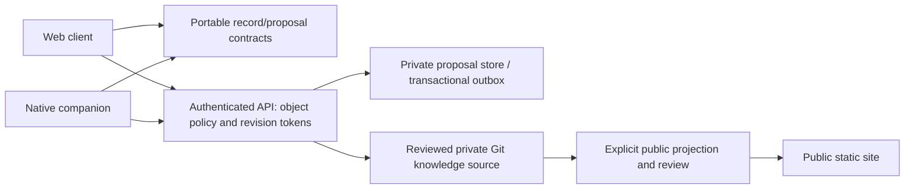

# Beyond the fictional local demo

Status: proposed next architecture, 2026-10-05. No provider, private account,
database, identity registration or native build has been provisioned here.
Further demo polish is lower priority than shared contracts, a backend and a
real native mobile slice. The parent coordinates the next bounded stages.

| Priority | Bounded deliverable and acceptance | Decision before execution |
| --- | --- | --- |
| 1. Portable contracts / synthetic API | Share record schemas, stable IDs, Markdown and relationship rules; create/read/revise/archive via local API with server revision tokens, idempotency and transactions. Two clients conflict safely; public projection excludes all non-allowlisted fields; denied objects never leak. | Confirm Git-first reviewed knowledge as canonical or approve another authority. Agree identity/tenant and publication policy before private integration. Local synthetic contracts need no cloud account. |
| 2. Native development slice | Android Capture/Explore/revision conflicts, restart persistence and JSON import/export against the synthetic API; shared fixtures pass. iOS simulator/device verification is a distinct outcome. | Choose React Native/Expo candidate or another framework, platform priority, app identifier and test devices. Confirm Android toolchain and Mac/Xcode availability. No store release or paid cloud build implied. |
| 3. Authenticated web/API staging | Verified identity, server membership/object permissions, isolated secrets, separate public/internal output, monitoring and a tested backup restore. Keep fixtures synthetic until data approval. | Approve provider/project, budget, domain, identity registration/scopes and operator. No automatic grants or private connections. |
| 4. Private native offline sync | Approved encrypted storage, durable outbox/retry/idempotency, conflict tokens, permission revalidation and revocation. Test restart, disconnection, concurrent writes and lost devices. | Decide permitted device data, key lifecycle/recovery, retention and revocation policy. Demo localStorage/PWA cache are not this engine. |
| 5. Restricted pilot / distribution | Named users/devices, accessibility/security acceptance, incident/export/restore runbook, rollback and owner review. | Approve actual data classes and research governance, signing ownership, accounts, fees and distribution path. Store publication remains separate. |

Resolve the preview hosting gap independently: all PWA assets need one HTTPS
origin. raw.githack redirects PNGs to another origin, preventing the deliberately
same-origin offline cache. Existing Pages can serve a reviewed static build
after owner-controlled merges; a separate stable staging origin is a provider
decision. Do not broaden worker scope/caching to compensate for the mirror.

## Portable synthetic slice implemented

Milestone 5 implements [contracts/](contracts/README.md), a shared portable
validator and strict v1 wire schemas, [loopback demo API](proposal-service/README.md)
and an explicit browser-memory adapter. Synthetic tests verify revisions,
actor-scoped idempotency, atomic memory commits, denied cross-project objects
and references, and allowlisted approved snapshots. There is no durable backend,
production identity or Git integration. Review/publication semantics remain
provisional and are documented with reversible choices in the contract guide.

The next priority is the [actual native development slice](NATIVE_DEVELOPMENT.md),
using these synthetic contracts, with Android SDK/device and iOS Mac/Xcode
prerequisites. Production provider and real-data decisions can remain deferred
while local native synthetic development proceeds.

## Boundaries and shared implementation

The default proposal follows the existing Git-first architecture: reviewed
Markdown is the portable knowledge source. A database, if approved, holds
durable proposals, queues and indexes; it must not silently become a competing
authority. Decide which states Git review and API revision tokens represent
before building sync. Authoritative lab systems and participant-level source
data stay outside this app; approved references are permitted pointers.

Extract schema/AST, ID, relationship, Markdown and publication contracts into
a portable package with synthetic fixtures. DOM, localStorage, Web Locks and
browser crypto stay behind web adapters; native storage/crypto/UI use their own
adapters. Candidate boundaries are `packages/records`, `apps/web`, `apps/mobile`,
`services/api` and `services/public-projection`. Refactor incrementally after
reviewing the stacked PRs, preserving the static preview until replacements
are tested. A wrapped HTML view or browser cache does not complete a native app.

## Server authority and publication

Use immutable IDs and server-controlled revision/ETag preconditions. Commit
new revisions/provenance in one transaction; use idempotency keys for proposed
writes. Actor/time come from the trusted server. Imported demo histories and
browser timestamps remain unverified claims. Preserve conflicts for explicit
comparison rather than last-write-wins. Server retention/deletion is an approved
policy decision distinct from this demo's reversible archive.

Each endpoint verifies identity, project/lab membership and object access,
including nested relationships and exports. Login, role labels or an API scope
alone are insufficient. [OWASP object authorization guidance](https://api-security.owasp.org/editions/2023/en/0xa1-broken-object-level-authorization/)
requires object-level authorization; [Microsoft protected API guidance](https://learn.microsoft.com/en-us/entra/identity-platform/scenario-protected-web-api-verification-scope-app-roles)
also covers scopes/app roles. Entra is only a candidate if the institution approves it.

Public builds start only from approved records and explicit field allowlists.
Synthetic negative fixtures must prove restricted identifiers/locators, proposals
and raw Markdown cannot reach HTML, search, logs or errors. Public/internal
storage and deployments have distinct boundaries, not hidden UI.

## Mobile and operational decisions

React Native/Expo is a candidate because the existing domain code is JavaScript;
validate it with an actual native slice before committing to a framework.
[Expo SQLite](https://docs.expo.dev/versions/latest/sdk/sqlite/) persists local
databases; SQLCipher requires explicit build configuration rather than being
default encryption. Web persistence has separate caveats, so share contracts
and adapters. [Expo SecureStore](https://docs.expo.dev/versions/latest/sdk/securestore/)
is a candidate for small credentials/keys, not a sole database or backup strategy.
Approve encryption/key recovery/device-data policy before private offline records.
No native dependency or build service was installed in this milestone.

Before staging, identify the service operator, approved region/retention, backup
restore targets, monitoring/incident response, secret rotation and expected cost.
Before private Git integration, approve the exact repository and least-privilege
server access; no credentials enter web/mobile clients. Before distribution,
confirm signing ownership, devices, accounts and fees. These decisions can be
gathered while Priority 1 remains local and synthetic, followed promptly by
the synthetic native slice. This plan authorizes no infrastructure or data release.
