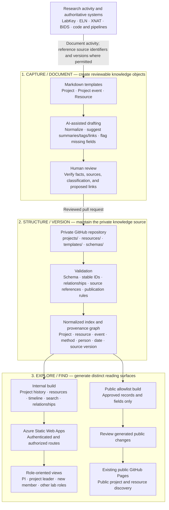

# LabHippo: Three-Layer Research Knowledge Architecture

- **Status:** Architecture draft
- **Date:** 2026-09-28
- **Scope:** A private Markdown knowledge source that generates a public research site and an access-controlled internal site.

## Purpose and boundaries

LabHippo turns research documentation into connected, versioned knowledge that people can explore from several perspectives. Its information flow is **Capture → Structure → Explore**. Markdown is the portable documentation format; Git records changes and review; generated sites provide search, navigation, and role-oriented views.

LabHippo does not replace the authoritative data held in LabKey, an electronic lab notebook (ELN), XNAT, BIDS datasets, or other controlled systems. It records context, decisions, documentation, and permitted references to those systems. Large files, credentials, and participant-level source data remain in systems approved for them.

## Three-layer architecture plot



The two generated sites are separate publication outputs. The public site receives only an explicitly approved projection. The internal site is deployed from the private source to Azure Static Web Apps with server-enforced access rules. A role-oriented page is a navigation view; it is not, by itself, an authorization rule.

## Layer 1 — Capture / Document

| Component | Function | Output |
| --- | --- | --- |
| Project template | Records a research project's identity, objectives, leadership, lifecycle stage, and links to its history. | One project Markdown record. |
| Project-event template | Records a dated decision, meeting, protocol change, analysis, QC finding, issue, milestone, or handover within a project. | A separate event record linked by `project_id`. |
| Resource template | Records reusable lab guidance, methods, software, equipment guidance, literature pointers, and other cross-project information. | One resource Markdown record. |
| AI assistance | Proposes normalized text, metadata, summaries, related records, and documentation gaps. | A draft for review, never an automatically accepted research claim. |
| Researcher review | Checks factual accuracy, provenance, source-system references, and permitted audience before submission. | A reviewable pull request. |

The default templates must not require participant, visit, or session identifiers. Such identifiers may be added only when the study's governance permits them in this repository and in the intended output. Public pages and indexes must not contain participant-level records or identifiers.

## Layer 2 — Structure / Version

### Record model

Every record has a stable `id`, `kind`, `title`, `summary`, `status`, `updated_at`, `steward`, `tags`, `related_ids`, and a publication classification. Presentation hints such as `audience` are separate from access permissions. A source reference identifies the authoritative system and its relevant version or stable locator when that reference is permitted.

| Record kind | Additional fields | Relationship |
| --- | --- | --- |
| `project` | `project_leader`, `pi`, `lifecycle_stage`, `objectives`, relevant dates. | Parent of project events; may link to resources. |
| `project-event` | `project_id`, `event_type`, `occurred_on`, outcome, next action, source references. | Belongs to exactly one project; may link to other events and resources. |
| `resource` | `category`, `intended_use`, `review_due`, applicability. | May apply to several projects or methods. |

An initial repository layout is:

```text
labhippo-records/                  # private GitHub repository
├── projects/
│   └── <project-id>/
│       ├── project.md
│       └── events/
│           └── <event-id>.md
├── resources/
│   └── <category>/
│       └── <resource-id>.md
├── templates/
│   ├── project.md
│   ├── project-event.md
│   └── resource.md
├── schemas/
├── site/                           # validation, indexing, and page generation
└── .github/workflows/
```

The repository is the source of truth for LabHippo documentation, not for the underlying research data. Its Git history shows when a Markdown record changed and who reviewed it. Reproducibility claims additionally require explicit dataset, pipeline, software, and external-system versions; a documentation commit alone does not establish those versions.

### Validation and indexing

After a pull request is merged, the build checks required fields, ID uniqueness, valid relationships, references, classification, and Markdown rendering. It then creates a normalized index. A record can appear in several facets—project, resource category, method, workflow stage, researcher, status, tag, or date—without duplicating the source record. Search indexes and relationship data inherit the same publication boundary as the pages that use them.

## Layer 3 — Explore / Find

| Output | Content and functions | Access |
| --- | --- | --- |
| Existing GitHub Pages | Approved public project and resource pages; public full-text search, metadata filters, and relationship navigation. | Public. |
| Azure Static Web Apps | Permitted internal project histories, resources, timelines, provenance links, full-text search, and filtered views. | Identity and route authorization must be configured before deployment. |

Suggested internal views are:

- **PI:** portfolio status, decisions needing attention, open issues, and cross-project dependencies.
- **Project leader:** assigned project history, milestones, issues, relevant resources, and next actions.
- **New member:** onboarding resources, terminology, current project context, and documented handovers.

These views select and arrange records. Whether a person may retrieve a page, JSON file, search index, or linked asset is a separate authorization decision. If project leaders must be restricted to only their own projects, the internal build and hosting design must enforce project-specific access rather than merely hiding links in the interface.

## Build and publication flow

1. A contributor creates or updates Markdown from a template and submits a pull request to the private repository.
2. Validation and human review establish the record's meaning, links, provenance, and publication classification.
3. After merge, the internal build regenerates the internal index and site for Azure Static Web Apps. Its production and preview URLs must enforce the intended access policy.
4. A separate public build starts from an explicit allowlist of approved records and fields. It generates only public HTML, assets, and search data.
5. The generated public changes are reviewed through a branch and pull request in the existing public site repository; the project owner merges that pull request before GitHub Pages updates.

The public builder must fail closed on missing or ambiguous publication approval. It must inspect all output formats, including JavaScript, JSON, search indexes, source maps, previews, and downloadable files, for private content. No lab-tier record is copied into the public repository.

## Decisions needed before implementation

1. Which identity provider will internal readers use: Microsoft Entra ID, GitHub, or an institution-managed option?
2. Is internal access lab-wide, or must it differ by project and individual? The answer determines whether static route rules are sufficient.
3. Which study identifiers and external-system links are permitted in the private repository and internal site?
4. Who approves a record for public release, and which fields may be published?

## First acceptance checks

- Multiple synthetic projects and resources validate, link, and appear consistently in all relevant facets and role-oriented views.
- A change to one Markdown record updates every derived page and search entry without manual duplication.
- Public output contains only allowlisted content, including in machine-readable assets and previews.
- Direct requests for internal pages and assets are denied to an unauthenticated or unauthorized visitor.
- Provenance links identify documentation commits separately from authoritative dataset and pipeline versions.

This document describes a proposed architecture. It does not indicate that the templates, pipeline, Azure deployment, or access rules have been implemented or verified.
